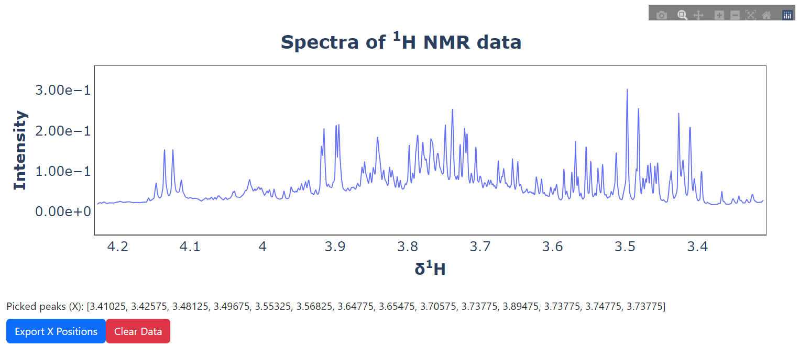

# lingress
The Lingress project is an initiative aimed at developing a streamlined pipeline for the analysis of Nuclear Magnetic Resonance (NMR) datasets, utilizing a univariate linear regression model. This package encompasses the execution of linear regression analysis via the Ordinary Least Squares (OLS) method and provides visual interpretations of the resultant data. Notably, it includes the p-values of all NMR peaks in its analytical scope.

Functionally, this program strives to fit a model of metabolic profiles through the application of linear regression. Its design and capabilities present a robust tool for in-depth and nuanced data analysis in the realm of metabolic studies.

## **Table of content**
[How to install](##how-to-install)
[UI peak picking](##ui-peak-picking)
[Linear regression model](##linear-regression-model)


## **How to install**

```bash
pip install lingress
```

## **UI Peak Picking**

```python
#Example data
import numpy as np
from lingress import pickie_peak

x = np.linspace(0, 10, 1000)
y = np.exp(-0.5 * ((x - 5)**2) / (0.2**2)) + np.random.normal(0, 0.02, x.size)
spectra = pd.DataFrame(y).T
ppm = x

#defind plot data and run UI
pickie_peak(spectra=spectra, ppm=ppm).run_ui()
```


## **Linear Regression model**


