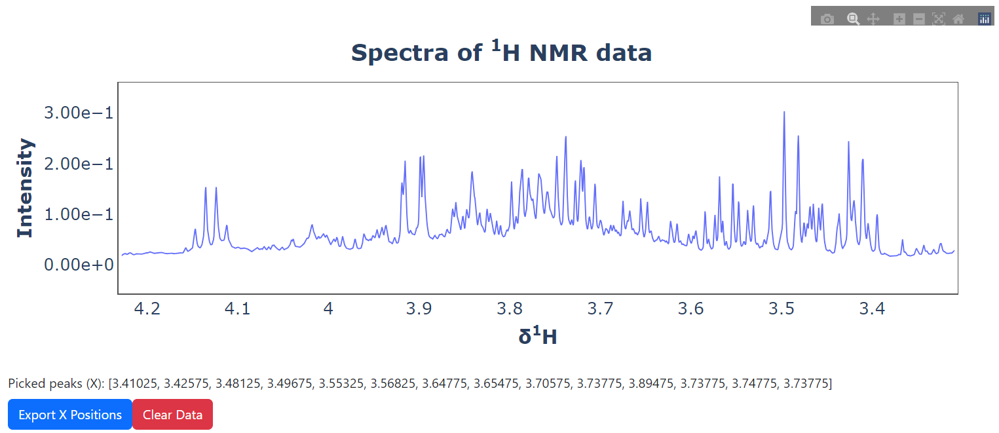
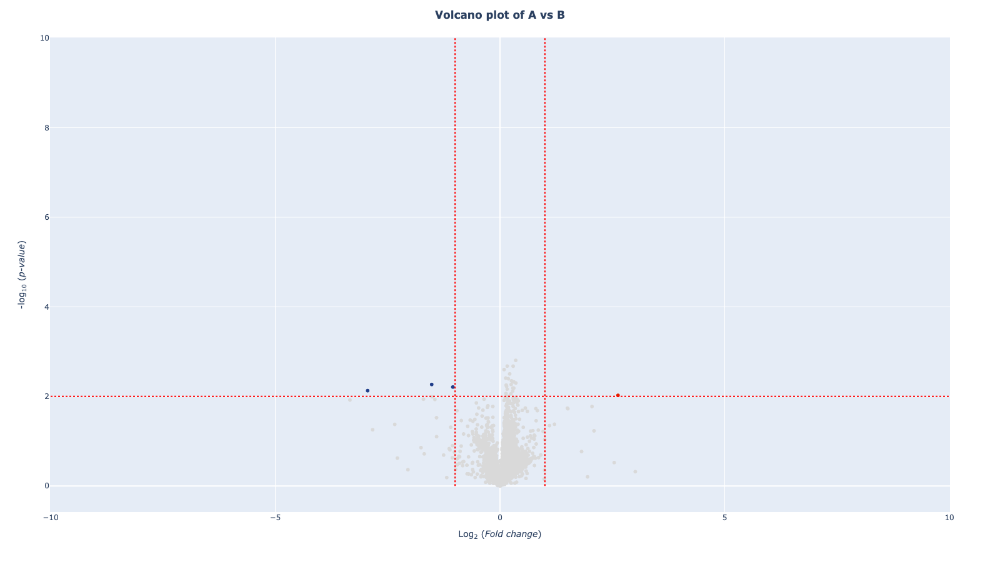

lingress
========

The Lingress project is an initiative aimed at developing a streamlined
pipeline for the analysis of Nuclear Magnetic Resonance (NMR) datasets,
utilizing a univariate linear regression model. This package encompasses
the execution of linear regression analysis via the Ordinary Least
Squares (OLS) method and provides visual interpretations of the
resultant data. Notably, it includes the p-values of all NMR peaks in
its analytical scope.

Functionally, this program strives to fit a model of metabolic profiles
through the application of linear regression. Its design and
capabilities present a robust tool for in-depth and nuanced data
analysis in the realm of metabolic studies.

**How to install**
------------------

.. code:: bash

   pip install lingress

**UI Peak Picking**
-------------------

.. code:: python

   #Example data
   import numpy as np
   from lingress import pickie_peak
   import pandas as pd

   df = pd.read_csv("https://raw.githubusercontent.com/aeiwz/example_data/main/dataset/Example_NMR_data.csv")
   spectra = df.iloc[:,1:]
   ppm = spectra.columns.astype(float).to_list()

   #defind plot data and run UI
   pickie_peak(spectra=spectra, ppm=ppm).run_ui()

   img1

**Linear Regression model**
---------------------------

.. code:: python

   import pandas as pd
   from lingress import lin_regression

   df = pd.read_csv("https://raw.githubusercontent.com/aeiwz/example_data/main/dataset/Example_NMR_data.csv")
   X = df.iloc[:,1:]
   ppm = spectra.columns.astype(float).to_list()
   y = df['Group']

   mod = lin_regression(x=X, target=y, label=y, features_name=ppm, adj_method='fdr_bh')
   mod.create_dataset()
   mod.fit_model()

.. code:: python

   mod.spec_uniplot()

.. figure:: ./src/img/spec_uniplot.png
   :alt: spec uniplot

   spec uniplot

.. code:: python

   mod.volcano_plot()

   volcano

.. code:: python

   mod.resampling(n_jobs=-1, n_boots=100, adj_method='fdr_bh')

::

   [Parallel(n_jobs=-1)]: Using backend LokyBackend with 8 concurrent workers.
   [Parallel(n_jobs=-1)]: Done   6 tasks      | elapsed:    3.7s
   [Parallel(n_jobs=-1)]: Done  60 tasks      | elapsed:    6.7s
   [Parallel(n_jobs=-1)]: Done 150 tasks      | elapsed:   11.2s
   [Parallel(n_jobs=-1)]: Done 276 tasks      | elapsed:   17.8s
   ...
   [Parallel(n_jobs=-1)]: Done 6486 tasks      | elapsed:  5.6min
   [Parallel(n_jobs=-1)]: Done 7188 tasks      | elapsed:  6.1min
   [Parallel(n_jobs=-1)]: Done 7211 out of 7211 | elapsed:  6.1min finished

.. code:: python

   mod.resampling_df()

+---+----+------+----+--------+-------+----+----+---+---------+----+
| P | s  | Beta | s  | Mean   | std   | Me | s  | R | std     | q  |
| - | td | coe  | td | P      | P-    | an | td | 2 | R       | _v |
| v | P  | ffic | Be | -value | value | R- | R- |   | -square | al |
| a | -v | ient | ta | (F     | (F-   | sq | sq |   | Adj     | ue |
| l | al |      |    | -test) | test) | ua | ua |   | ustment |    |
| u | ue |      |    |        |       | re | re |   |         |    |
| e |    |      |    |        |       |    |    |   |         |    |
+===+====+======+====+========+=======+====+====+===+=========+====+
| 0 | 3. | 1.61 | 3. | 5      | 0.4   | 0. | 0. | 0 | 0       | 4. |
| . | 57 | 0523 | 67 | 02596. | 34302 | 27 | 13 | . | .030981 | 01 |
| 6 | 54 | e-02 | 31 | 020205 |       | 68 | 86 | 1 |         | 28 |
| 0 | 54 |      | 94 |        |       | 09 | 50 | 5 |         | 56 |
| 0 | e- |      | e+ |        |       |    |    | 6 |         | e- |
| 7 | 03 |      | 06 |        |       |    |    | 2 |         | 03 |
| 5 |    |      |    |        |       |    |    | 4 |         |    |
|   |    |      |    |        |       |    |    | 4 |         |    |
+---+----+------+----+--------+-------+----+----+---+---------+----+
| 0 | 2. | 6.41 | 4. | 6      | NaN   | N  | 0. | 0 | 0       | 3. |
| . | 32 | 8472 | 20 | 38734. |       | aN | 16 | . | .056503 | 53 |
| 6 | 76 | e-04 | 83 | 119190 |       |    | 02 | 1 |         | 14 |
| 0 | 87 |      | 65 |        |       |    | 25 | 7 |         | 43 |
| 1 | e- |      | e+ |        |       |    |    | 5 |         | e- |
| 2 | 04 |      | 06 |        |       |    |    | 4 |         | 04 |
| 5 |    |      |    |        |       |    |    | 6 |         |    |
|   |    |      |    |        |       |    |    | 3 |         |    |
+---+----+------+----+--------+-------+----+----+---+---------+----+
| 0 | 1. | 3.69 | 4. | 5      | 0.2   | 0. | 0. | 0 | 0       | 2. |
| . | 51 | 0541 | 77 | 82175. | 72894 | 25 | 25 | . | .157111 | 44 |
| 6 | 18 | e-04 | 69 | 023885 |       | 80 | 07 | 2 |         | 38 |
| 0 | 46 |      | 24 |        |       | 94 | 65 | 0 |         | 29 |
| 1 | e- |      | e+ |        |       |    |    | 4 |         | e- |
| 7 | 04 |      | 06 |        |       |    |    | 5 |         | 04 |
| 5 |    |      |    |        |       |    |    | 4 |         |    |
|   |    |      |    |        |       |    |    | 2 |         |    |
+---+----+------+----+--------+-------+----+----+---+---------+----+
| 0 | 2. | 7.13 | 4. | 6      | 0.1   | 0. | 0. | 0 | 0       | 4. |
| . | 72 | 8873 | 45 | 24407. | 32108 | 18 | 37 | . | .302422 | 03 |
| 6 | 43 | e-04 | 08 | 676115 |       | 85 | 99 | 1 |         | 72 |
| 0 | 37 |      | 84 |        |       | 70 | 31 | 9 |         | 37 |
| 2 | e- |      | e+ |        |       |    |    | 8 |         | e- |
| 2 | 04 |      | 06 |        |       |    |    | 0 |         | 04 |
| 5 |    |      |    |        |       |    |    | 5 |         |    |
|   |    |      |    |        |       |    |    | 5 |         |    |
+---+----+------+----+--------+-------+----+----+---+---------+----+
| 0 | 2. | 5.23 | 3. | 6      | 0.0   | 0. | 0. | 0 | 0       | 3. |
| . | 27 | 8926 | 59 | 43161. | 30732 | 05 | 55 | . | .503253 | 45 |
| 6 | 16 | e-04 | 66 | 588649 |       | 69 | 84 | 1 |         | 81 |
| 0 | 75 |      | 22 |        |       | 68 | 47 | 5 |         | 06 |
| 2 | e- |      | e+ |        |       |    |    | 8 |         | e- |
| 7 | 04 |      | 06 |        |       |    |    | 9 |         | 04 |
| 5 |    |      |    |        |       |    |    | 4 |         |    |
|   |    |      |    |        |       |    |    | 8 |         |    |
+---+----+------+----+--------+-------+----+----+---+---------+----+
| … | …  | …    | …  | …      | …     | …  | …  | … | …       | …  |
+---+----+------+----+--------+-------+----+----+---+---------+----+
| 4 | 2. | 1.07 | 2. | 4      | NaN   | N  | 0. | 0 | -0      | 4. |
| . | 54 | 7483 | 23 | 79783. |       | aN | 09 | . | .010838 | 47 |
| 2 | 27 | e-08 | 18 | 299949 |       |    | 92 | 1 |         | 20 |
| 0 | 07 |      | 41 |        |       |    | 55 | 3 |         | 63 |
| 3 | e- |      | e+ |        |       |    |    | 0 |         | e- |
| 7 | 09 |      | 07 |        |       |    |    | 3 |         | 08 |
| 5 |    |      |    |        |       |    |    | 2 |         |    |
|   |    |      |    |        |       |    |    | 1 |         |    |
+---+----+------+----+--------+-------+----+----+---+---------+----+
| 4 | 4. | 1.26 | 2. | 6      | 0.4   | 0. | 0. | 0 | 0       | 1. |
| . | 72 | 9310 | 20 | 31164. | 20162 | 30 | 16 | . | .059199 | 94 |
| 2 | 71 | e-09 | 18 | 491894 |       | 81 | 37 | 1 |         | 06 |
| 0 | 99 |      | 65 |        |       | 96 | 33 | 8 |         | 90 |
| 4 | e- |      | e+ |        |       |    |    | 4 |         | e- |
| 2 | 10 |      | 07 |        |       |    |    | 1 |         | 08 |
| 5 |    |      |    |        |       |    |    | 5 |         |    |
|   |    |      |    |        |       |    |    | 3 |         |    |
+---+----+------+----+--------+-------+----+----+---+---------+----+
| 4 | 1. | 4.65 | 2. | 7      | NaN   | N  | 0. | 0 | -0      | 3. |
| . | 71 | 9603 | 28 | 21568. |       | aN | 10 | . | .010207 | 59 |
| 2 | 04 | e-09 | 50 | 566334 |       |    | 09 | 1 |         | 59 |
| 0 | 47 |      | 26 |        |       |    | 27 | 3 |         | 28 |
| 4 | e- |      | e+ |        |       |    |    | 8 |         | e- |
| 7 | 09 |      | 07 |        |       |    |    | 5 |         | 08 |
| 5 |    |      |    |        |       |    |    | 2 |         |    |
|   |    |      |    |        |       |    |    | 7 |         |    |
+---+----+------+----+--------+-------+----+----+---+---------+----+
| 4 | 1. | 9.45 | 2. | 2      | 0.3   | 0. | 0. | 0 | 0       | 1. |
| . | 04 | 4456 | 44 | 87615. | 10386 | 30 | 26 | . | .171707 | 08 |
| 2 | 36 | e-08 | 93 | 593479 |       | 14 | 37 | 2 |         | 44 |
| 0 | 58 |      | 45 |        |       | 03 | 40 | 4 |         | 12 |
| 5 | e- |      | e+ |        |       |    |    | 5 |         | e- |
| 2 | 08 |      | 07 |        |       |    |    | 9 |         | 07 |
| 5 |    |      |    |        |       |    |    | 9 |         |    |
|   |    |      |    |        |       |    |    | 6 |         |    |
+---+----+------+----+--------+-------+----+----+---+---------+----+
| 4 | 1. | 1.12 | 2. | 2      | 0.2   | 0. | 0. | 0 | 0       | 1. |
| . | 60 | 3188 | 62 | 46414. | 42344 | 25 | 29 | . | .212366 | 45 |
| 2 | 69 | e-07 | 11 | 620688 |       | 73 | 98 | 2 |         | 75 |
| 0 | 48 |      | 35 |        |       | 00 | 81 | 4 |         | 72 |
| 5 | e- |      | e+ |        |       |    |    | 4 |         | e- |
| 7 | 08 |      | 07 |        |       |    |    | 7 |         | 07 |
| 5 |    |      |    |        |       |    |    | 7 |         |    |
|   |    |      |    |        |       |    |    | 2 |         |    |
+---+----+------+----+--------+-------+----+----+---+---------+----+
